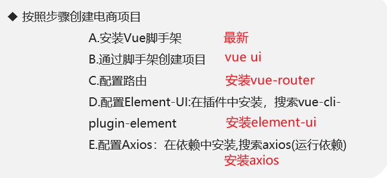
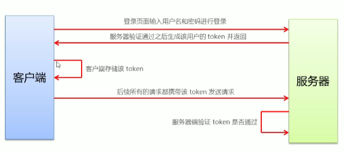
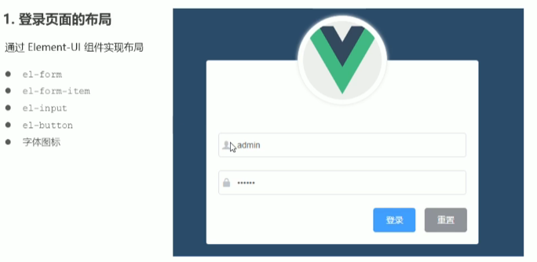
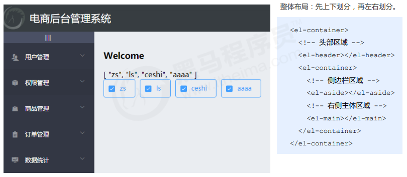

# Vue项目：电商管理系统

管理系统的思路： 人 -> 角色 -> 权限

后台会根据我们的登录账号匹配到角色，不同角色权限不同。亲测请求数据返回的结果也不同

## 优化工作

- 对axios配置进行了优化，封装成独立文件
- 路由懒加载 -> 原理
- 

bug: 重新到界面以后自动展开

## 1.项目概况

### 技术选型

| 前端项目技术栈 | 后端项目技术栈 |
| -------------- | -------------- |
| Vue            | Node.js        |
| Vue-router     | Express        |
| Element-UI     | Jwt            |
| Axios          | Mysql          |
| Echarts        | Sequelize      |

## 2.项目准备工作

### 2.1 创建项目

> 在图形化界面中完成



### 2.2 将本地项目托管到github

略过

### 2.3 开启数据库

安装最新版[phpStudy](https://www.xp.cn/)以及导入sql，只开启sql，不需要Nginx和Apache

1. 启动mysql
   

2. 创建数据库

   

接着导入数据库，在后端项目db文件夹中。如果mydb文件夹不为空说明数据库导入成功。

3. 后端项目config/default.json中进行配置数据库名、端口号、用户和密码
   

### 2.4 开启后端项目

运行vue_api_server, 并使用poatman测试接口

vue_api_server是一个后端项目，npm install安装依赖，再在命令行中输入node ./app.js开启服务

测试成功：:arrow_down:


## 3.登录/退出功能

### 3.1 登录概述

1. 登录业务流程
   ①在登录页面输入用户名和密码
   ②调用后台接口进行验证
   ③通过验证以后，根据后台的响应状态跳转到项目主页

2. 登录业务的相关技术点

   - http是无状态的
   - 通过cookie在客户端记录登录状态
   - 通过session在服务端记录状态
   - 通过token方式维持状态

   如果前端和服务器之间存在跨域问题，用token方案。
   反之使用cookie和session维持登录状态。

### 3.2 登录原理分析

由于存在跨域问题，所以要用token方案。（跨域：协议或域名或端口号不同）



### 3.3 登录功能实现



#### 1.创建并切换分支

git checkout -b login

注意：

`git branch branchName `创建分支    

 `  git checkout branchName `切换分支      

`git checkout -b branchName`创建并切换分支

#### 2.在GUI中开启项目

本项目中全部使用GUI，不涉及命令行

`vue ui`

#### 3.清理脚手架中不必要的内容

删除自带的原始内容

#### 4.配置路由

重定向 `redirect`

#### 5.安装`less`和`less-loader`

在GUI依赖中-开发依赖，不需要再手动配置

> 注意：在这里防止版本过高而报错，我使用命令行安装低版本
>
> npm install less-loader@4.1.0  --save-dev  		
>
> npm install  less@3.9.0 --save-dev

#### 6.input输入框中的图标 

在输入框后面suffix-icon="el-icon-date"

在输入框前面prefix-icon="el-icon-search"

#### 7.引入iconfont  

main.js全局导入，再在suffix-icon或prefix-icon中填入对应的类名

`import './assets/fonts/iconfont.css'`

#### 8.实现表单的数据绑定:star:   :model

为`el-form`添加:model绑定loginForm(自由命名，下同)数据对象，为每一对表单通过`v-model`通过`form.`绑定到对象对应的属性中。

```javascript
<!-- 表单区域 -->
<el-form class="login_form" :model="loginForm">
    <!-- 用户名 -->
    <el-form-item>
        <el-input prefix-icon="iconfont icon-user" 
                  v-model="loginForm.username"></el-input>
    </el-form-item>
    <!-- 密码 -->
    <el-form-item>
        <el-input prefix-icon="iconfont icon-3702mima" 
                  v-model="loginForm.password" type="password"></el-input>
    </el-form-item>
</el-form>

  data() {     //在子组件中data是一个函数，且必须返回对象
    return {
      //这是登录表单的数据绑定对象
      loginForm: {
        username: '',
        password: ''
      }
    }
  }
```

#### 9.实现表单数据验证:star2:   :rules

为`el-form`添加:rules绑定校验对象，为每一个`form-item`通过`prop`属性指定具体的验证规则。**与数据绑定不同**

```javascript
<el-form-item prop="username">
    <el-input prefix-icon="iconfont icon-user" 
              v-model="loginForm.username"></el-input>
</el-form-item>

data() {
  return {
    //这是表单的验证规则对象
    loginFormRules: {
        username: [   //验证用户名是否合法
          { required: true, message: '请输入登录昵称', trigger: 'blur' }, //失去焦点触发
          { min: 3, max: 10, message: '长度在 3 到 10 个字符', trigger: 'blur' }
        ]
      }
  }
}
```

#### 10.表单的重置

点击`重置`按钮重置所有表单

为登录按钮绑定单击事件

```javascript
<el-button type="info" @click="resetLoginForm">重置</el-button>
```

通过ref获取dom

```javascript
<el-form class="login_form" :model="loginForm" :rules="loginFormRules" ref="loginFormRef">
```

触发函数

```javascript
  methods: {
    //点击按钮，重置登录表单
    resetLoginForm() {
      this.$refs.loginFormRef.resetFields() 
    }
  }
```

#### 11.实现登录前表单数据的预验证

登录按钮绑定

```javascript
<el-button type="primary" @click="login">登录</el-button>
```

```javascript
    login() {
      this.$refs.loginFormRef.validate(async (valid) => {
        if (!valid) return
        const { data: res } = await this.$http.post('login', this.loginForm) //解构
        //post返回值时promise为了简化promise操作，可以用async,await进行优化
        //async 函数返回值是 Promise 对象
        if (res.meta.status !== 200) return this.$message.error('登陆失败')
        //消息提示实际上就是函数
        this.$message.success('登陆成功')
        //1.将登陆成功之后的token,保存到客户端的sessionStotage中
        //  1.1 项目中除了登录之外的其他的API接口，必须在登录之后才能访问
        //  1.2 token只应在当前网站打开期间生效，所以将token保存在sessionStorage中
        console.log(res)
        window.sessionStorage.setItem('token', res.data.token)
        //2. 通过编程式导航跳转到后台页面，路由地址是/home
        this.$router.push('/home')
      })
    }
```

> async 函数返回值是 Promise 对象 

> async是ES7新出的特性，表明当前函数是异步函数，不会阻塞线程导致后续代码停止运行。
>
> async 表示函数里有异步操作
>
> await 表示紧跟在后面的表达式需要等待结果。

[一次性让你懂async/await，解决回调地狱](https://juejin.cn/post/6844903621360943118)

[JavaScript异步机制详解](https://juejin.cn/post/6844903556084924423#heading-0)  

[理解 JavaScript 的 async/await](https://segmentfault.com/a/1190000007535316)

#### 12.配置axios发送登录请求

在`main.js`中

```javascript
import axios from 'axios'

Vue.prototype.$http = axios  //在组件中就可以直接使用this.$htpp 相当于axios
axios.defaults.baseURL = "http://127.0.0.1:8888/api/private/v1/" //根据请求配置根路径，这里是本机
```

#### 13.配置Message全局弹框组件

在`plugin/element.js`中，引入

```javascript
import { Button, Message } from 'element-ui'
Vue.use(Button)
//全局配置，之后就可以直接使用this.$message
Vue.prototype.$message = Message
```

#### 14.完善登陆之后的操作

Application-> Session Storage   查看token

登陆以后保存token,跳转到/home

```javascript
window.sessionStorage.setItem('token', res.data.token)   //sessionStorage属于window对象
this.$router.push('/home')
```

#### 15.路由导航守卫控制页面访问权限

```javascript
//挂载路由导航守卫
router.beforeEach((to,from,next) => {
  //to将要访问的路径 from代表从哪个路径来 next表示放行
  // 两种方式  1.next()  2.next('/login')   //强制放行到指定路由
  if(to.path === '/login') return next()
  //获取token
  const tokenStr = window.sessionStorage.getItem('token')
  if(!tokenStr) return next('/login')
  next()
})
```

#### 16.实现退出功能

思路，清空`sessionStorage`,再跳转到登录页面

```javascript
logout() {
      window.sessionStorage.clear()
      this.$router.push('/login')
    }
```

#### 17.代码规范

1. 不应该出现分号     双引号用单引号替换
   vscode右键格式化和eslint规范不同，在根目录下创建文件`.prettierrc`，内容

   ```
   {
     "semi": false,
     "singleQuote": true
   }
   ```

2. 解决函数的（）前必须加括号问题

   ​	根目录下`.eslintrc.js` ,  rules中加上 "space-before-function-paren": 0;   注意：我没有使用eslint

3. crtl + `  vscode终端快捷键

4. git push -u origin login 将新建分支上传到云端

## 4.主页开发

### 4.1 实现基本的页面布局




### 4.2 通过接口获取菜单数据

通过axios请求拦截器添加token，保证拥有获取数据的权限

## 5.权限管理

## 项目优化策略

1. ### 生成打包报告

2. ### 第三方库启用CDN

3. ### Element-UI组件按需加载

4. ### 路由懒加载

5. ### 首页内容顶置

通过nprogress添加进度条效果

babel-plugin-transform-remove-console移除所有console.log，配置只在发布阶段生效

1.在babel.config.js中添加


2.只在发布阶段使用插件

