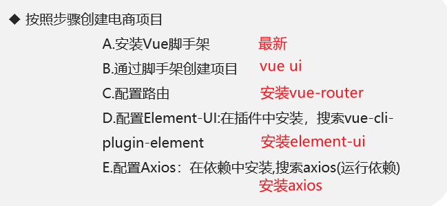
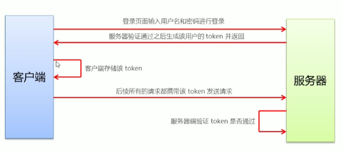
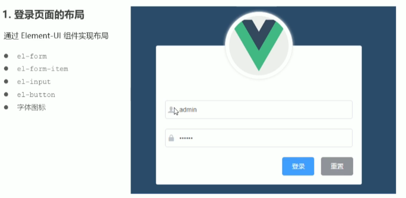

# Vue实战项目：电商管理系统

## 1.项目概况

### 技术选型

| 前端项目技术栈 | 后端项目技术栈 |
| -------------- | -------------- |
| Vue            | Node.js        |
| Vue-router     | Express        |
| Element-UI     | Jwt            |
| Axios          | Mysql          |
| Echarts        | Sequelize      |

## 2.项目准备工作

### 2.1 创建项目



### 2.2 将本地项目托管到github

### 2.3 安装mysql

安装phpStudy以及导入mysql

### 2.4 配置api接口服务并使用postman发送请求调试接口

运行vue_api_server,并使用poatman测试接口

## 3.电商项目登录功能

### 3.1 登录概述

1. 登录业务流程
   ①在登录页面输入用户名和密码
   ②调用后台接口进行验证
   ③通过验证以后，根据后台的响应状态跳转到项目主页

2. 登录业务的相关技术点

   - http是无状态的
   - 通过cookie在客户端记录登录状态
   - 通过session在服务端记录状态
   - 通过token方式维持状态

   如果前端和服务器之间存在跨域问题，用token方案。
   反之使用cookie和session维持登录状态。

   ### 3.2 登录 - token原理分析



### 3.3 登录功能实现



#### 1.创建分支

git checkout -b login

#### 2.在GUI中开启项目

本项目中全部使用GUI，不涉及命令行

#### 3.清理脚手架中不必要的内容

删除自带的原始内容

#### 4.配置路由

重定向 `redirect`

#### 5.安装`less`和`less-loader`

在GUI依赖中-开发依赖，不需要再手动配置

#### 6.input输入框中的图标 

在输入框后面suffix-icon="el-icon-date"

在输入框前面prefix-icon="el-icon-search"

#### 7.引入iconfont  

main.js全局导入，再在suffix-icon或prefix-icon中填入对应的类名

#### 8.实现表单的数据绑定:star:   :model

为`el-form`添加:model绑定loginForm(自由命名，下同)数据对象，为每一对表单通过`v-model`通过`form.`绑定到对象对应的属性中。

```javascript
<!-- 表单区域 -->
<el-form class="login_form" :model="loginForm">
    <!-- 用户名 -->
    <el-form-item>
        <el-input prefix-icon="iconfont icon-user" 
                  v-model="loginForm.username"></el-input>
    </el-form-item>
    <!-- 密码 -->
    <el-form-item>
        <el-input prefix-icon="iconfont icon-3702mima" 
                  v-model="loginForm.password" type="password"></el-input>
    </el-form-item>
    <!-- 按钮区 -->
    <el-form-item class="btns">
        <el-button type="primary">登录</el-button>
        <el-button type="info">重置</el-button>
    </el-form-item>
</el-form>

  data() {     //在子组件中data是一个函数，且必须返回对象
    return {
      //这是登录表单的数据绑定对象
      loginForm: {
        username: '',
        password: ''
      }
    }
  }
```

#### 9.实现表单数据验证:star2:   :rules

为`el-form`添加:rules绑定校验对象，为每一`form-item`通过`prop`属性指定具体的验证规则。**与数据绑定不同**

```javascript
<el-form-item prop="username">
    <el-input prefix-icon="iconfont icon-user" 
              v-model="loginForm.username"></el-input>
</el-form-item>

data() {
  return {
    //这是表单的验证规则对象
    loginFormRules: {
        username: [   //验证用户名是否合法
          { required: true, message: '请输入登录昵称', trigger: 'blur' }, //失去焦点触发
          { min: 3, max: 10, message: '长度在 3 到 10 个字符', trigger: 'blur' }
        ]
      }
  }
}
```

#### 10.表单的重置

点击`重置`按钮重置所有表单

为登录按钮绑定单击事件

```javascript
<el-button type="info" @click="resetLoginForm">重置</el-button>
```

通过hre获取dom

```javascript
<el-form class="login_form" :model="loginForm" :rules="loginFormRules" ref="loginFormRef">
```

触发函数

```javascript
  methods: {
    //点击按钮，重置登录表单
    resetLoginForm() {
      this.$refs.loginFormRef.resetFields() 
    }
  }
```

#### 11.实现登录前表单数据的预验证

12.配置axios发送登录请求

13.配置Message全局弹框组件

14.完善登陆之后的操作

Application-> Session Storage ->

15.路由导航守卫控制页面访问权限

16.实现退出功能

17.代码规范

不应该出现分号  双引号用单引号替换

.eslintrc.js  rules中 "space-before-function-paren": 0;


crtl + `

